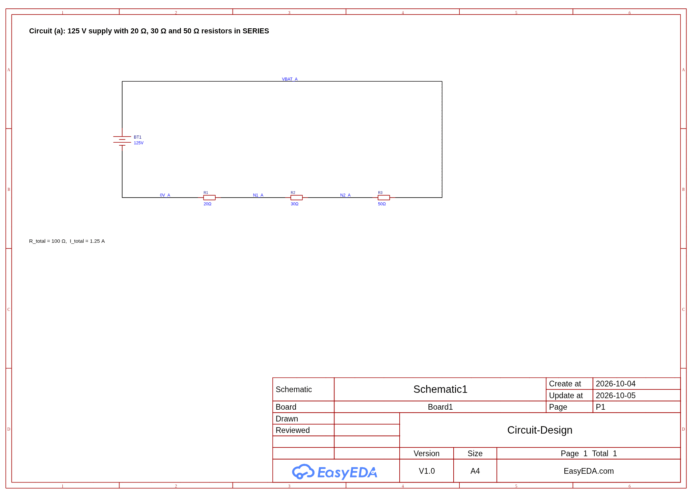
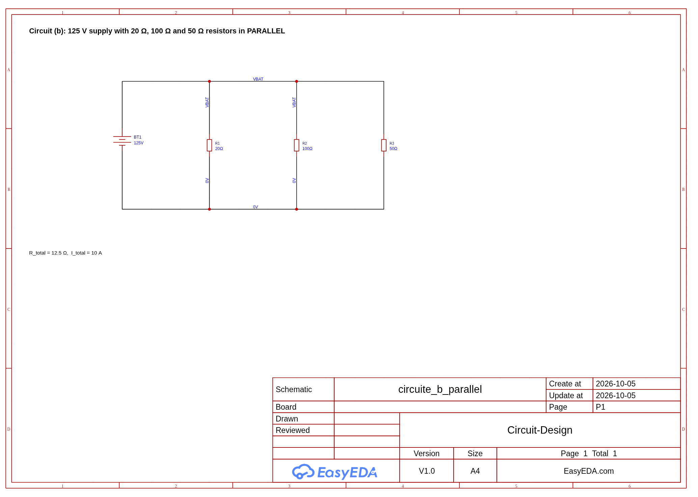
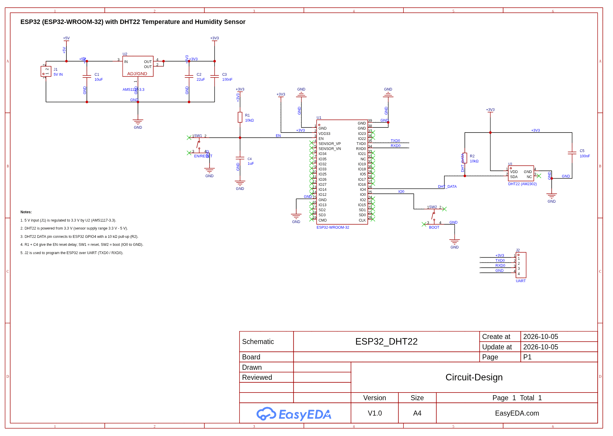

# Circuit Design

## Embedded Systems and IoT Lab Exercise

This project presents the design and documentation of basic electrical circuits and an ESP32-based IoT sensor circuit. It includes resistor-network calculations, EasyEDA Pro schematics, component lists, and supporting PDF exports for submission.

---

## Group Members

| Name | Registration Number |
|---|---:|
| Amir Fuad | 193554 |
| Cyprian Kiprop | 178883 |
| Miyen Aguek | 152756 |
| Steaven Ouor | 191932 |
| Abdulfatah Gobu | 192181 |

---

## Overview

This project includes:

- Part A calculations for series and parallel resistor circuits.
- Part B schematics created in EasyEDA Pro.
- Component lists for each schematic.
- PDF exports containing the same work for easy review and submission.

The README provides a clean summary of the complete work, while the attached PDFs contain the detailed calculation and schematic documents.

---

## Part A: Circuit Calculations

Part A focuses on analyzing two resistor circuits powered by a 125 V DC supply. The required values include total resistance, total current, and total power for each circuit.

| Circuit | Configuration | Supply Voltage | Total Resistance | Total Current | Total Power |
|---|---:|---:|---:|---:|---:|
| A | 20 ohm + 30 ohm + 50 ohm series circuit | 125 V | 100 ohm | 1.25 A | 156.25 W |
| B | 20 ohm, 100 ohm, and 50 ohm parallel circuit | 125 V | 12.5 ohm | 10 A | 1250 W |

Full calculations are available in [Circuit-Design Part A.pdf](Circuit-Design%20Part%20A.pdf).

---

## Part B: Schematics

Part B contains the schematic designs produced in EasyEDA Pro. Each circuit is exported as a PDF and shown below as an image for quick viewing.

### Circuit A: Series Resistor Circuit

Circuit A connects three resistors in series across a 125 V supply. In a series circuit, the same current flows through each resistor, while the total resistance is the sum of all resistor values.

Component list:

| Ref | Component | Value | Qty |
|---|---|---:|---:|
| BT1 | DC power supply | 125 V | 1 |
| R1 | Resistor | 20 ohm | 1 |
| R2 | Resistor | 30 ohm | 1 |
| R3 | Resistor | 50 ohm | 1 |

[Open Circuit A schematic PDF](PartB1_Circuit_a_Series_Schematic.pdf)

### Circuit B: Parallel Resistor Circuit

Circuit B connects three resistors in parallel across a 125 V supply. In a parallel circuit, each resistor receives the same voltage, while the total current is shared across the branches.

Component list:

| Ref | Component | Value | Qty |
|---|---|---:|---:|
| BT1 | DC power supply | 125 V | 1 |
| R1 | Resistor | 20 ohm | 1 |
| R2 | Resistor | 100 ohm | 1 |
| R3 | Resistor | 50 ohm | 1 |

[Open Circuit B schematic PDF](PartB1_Circuit_b_Parallel_Schematic.pdf)

### ESP32 and DHT22 Sensor Circuit

The ESP32 and DHT22 circuit demonstrates a simple IoT hardware design. It includes a 5 V input, 3.3 V regulation, UART programming header, reset and boot controls, and a DHT22 temperature and humidity sensor with pull-up and decoupling components.

Component list:

| Ref | Component | Value / Part | Qty |
|---|---|---:|---:|
| U1 | ESP32 Wi-Fi/BT module | ESP32-WROOM-32 | 1 |
| U2 | LDO voltage regulator | AMS1117-3.3 | 1 |
| U3 | Temperature and humidity sensor | DHT22 / AM2302 | 1 |
| J1 | Power input connector | 5 V, 2-pin | 1 |
| J2 | UART programming header | 4-pin, 2.54 mm | 1 |
| C1 | Regulator input capacitor | 10 uF | 1 |
| C2 | Regulator output capacitor | 22 uF | 1 |
| C3 | 3.3 V decoupling capacitor | 100 nF | 1 |
| C4 | EN reset delay capacitor | 1 uF | 1 |
| C5 | DHT22 decoupling capacitor | 100 nF | 1 |
| R1 | EN pull-up resistor | 10 kohm | 1 |
| R2 | DHT22 data pull-up resistor | 10 kohm | 1 |
| SW1 | EN / RESET push button | Tactile switch | 1 |
| SW2 | BOOT / IO0 push button | Tactile switch | 1 |

[Open ESP32 and DHT22 schematic PDF](PartB2_ESP32_DHT22_Schematic.pdf)

---

## Main Components

| Section | Key components |
|---|---|
| Circuit A | 125 V DC supply, 20 ohm resistor, 30 ohm resistor, 50 ohm resistor |
| Circuit B | 125 V DC supply, 20 ohm resistor, 100 ohm resistor, 50 ohm resistor |
| ESP32 + DHT22 | ESP32-WROOM-32, AMS1117-3.3 regulator, DHT22 sensor, UART header, reset and boot switches, pull-up resistors, decoupling capacitors |

---

## Project Files

| File or folder | Purpose |
|---|---|
| `Circuit-Design Part A.pdf` | Calculation work for the resistor circuits |
| `PartB1_Circuit_a_Series_Schematic.pdf` | Series circuit schematic |
| `PartB1_Circuit_b_Parallel_Schematic.pdf` | Parallel circuit schematic |
| `PartB2_ESP32_DHT22_Schematic.pdf` | ESP32 and DHT22 schematic |
| `README.md` | Main project summary with images and component tables |

---

## Conclusion

The project combines circuit analysis with practical schematic design. The resistor circuits demonstrate the difference between series and parallel electrical behavior, while the ESP32 and DHT22 schematic introduces a basic embedded IoT system suitable for sensing temperature and humidity.
